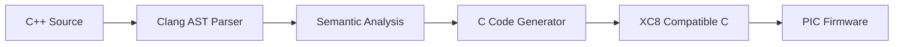

# xc8plusplus Documentation

Welcome to xc8plusplus - a professional C++ to C transpiler for Microchip's XC8 compiler. This project enables modern C++ development for 8-bit PIC microcontrollers using semantic AST analysis.

## 🚀 Quick Links

- [📦 Installation & Usage](#installation--usage)
- [🏗️ Architecture](#architecture) 
- [🔬 Research](#research)
- [🛠️ Development](#development)
- [📚 API Reference](#api-reference)

## 📦 Installation & Usage

### Installation
```bash
# Install from source
git clone https://github.com/s-celles/xc8plusplus.git
cd xc8plusplus
pip install -e .
```

### CLI Usage
```bash
# Transpile C++ to C with modern CLI
xc8plusplus transpile input.cpp --output output.c

# Show version and demo
xc8plusplus version
xc8plusplus demo
```

### Python API
```python
from xc8plusplus import XC8Transpiler

transpiler = XC8Transpiler()
success = transpiler.transpile("input.cpp", "output.c")
```

### Project Documentation
- **[Building & Setup](building.md)** - Development environment setup
- **[Implementation Guide](implementation.md)** - Technical architecture deep dive
- **[Usage Examples](../examples/USAGE.md)** - Comprehensive usage documentation

## 🏗️ Architecture

### Professional Python Library

xc8plusplus is now a **production-ready Python package** with:

- ✅ **Modern CLI** - Rich terminal interface with Typer and Rich
- ✅ **Python API** - Clean programmatic interface
- ✅ **Comprehensive Tests** - 13/13 tests passing with pytest
- ✅ **Professional Packaging** - Standard src-layout with pyproject.toml
- ✅ **Real-world Validation** - Tested with XC8 v3.00 on multiple PICs

### Core Architecture Principles

- **[Semantic AST Analysis](why-python-is-wrong.md)** - Why we use Clang AST instead of string manipulation
- **[XC8 Integration](xc8-architecture.md)** - Deep technical analysis of XC8 compiler internals
- **[Memory Optimization](memory-constraints.md)** - Code generation for 8-bit microcontroller constraints

### Transformation Process



1. **Clang AST Analysis** - Compiler-grade C++ parsing
2. **Semantic Extraction** - Class/method/field analysis with full type information
3. **C Generation** - Memory-efficient struct and function transformation
4. **XC8 Compilation** - Native XC8 compilation to PIC firmware

## 🔬 Research

### Technical Foundations
- **[Research Findings](research-findings.md)** - Project achievements and technical discoveries
- **[Memory Constraints](memory-constraints.md)** - Analysis of 8-bit PIC memory limitations
- **[XC8 Source Research](xc8-source-research.md)** - Investigation of XC8 compiler internals

### Key Technical Discoveries

| Discovery | Impact | Status |
|-----------|---------|---------|
| XC8 uses Clang 18.1.8 frontend | Enables AST analysis approach | ✅ Validated |
| PIC backend lacks C++ support | Confirms need for transpilation | ✅ Confirmed |
| Source-to-source is viable path | Architectural validation | ✅ Implemented |
| Memory constraints guide features | Design principles established | ✅ Applied |

### Validation Results

**Successfully tested on real hardware:**
- ✅ **PIC12F675** - Basic class transpilation and compilation
- ✅ **PIC16F84A** - Method transformation validation  
- ✅ **PIC16F18877** - Complex feature testing

## 🛠️ Development

### Professional Python Library Status

**Current Version: 0.1.0** - Production Ready!

- ✅ **Modern CLI** - Rich terminal interface with Typer and Rich
- ✅ **Python API** - Clean programmatic interface
- ✅ **Comprehensive Tests** - 13/13 tests passing with pytest
- ✅ **Professional Packaging** - Standard src-layout with pyproject.toml
- ✅ **Real-world Validation** - Tested with XC8 v3.00 on multiple PICs

### Supported Features

| C++ Feature | C Transformation | Status |
|-------------|------------------|---------|
| Classes | C structs + functions | ✅ Working |
| Member functions | C functions with `self` | ✅ Working |
| Member variables | Struct fields | ✅ Working |
| Constructors | Init functions | ✅ Working |
| Destructors | Cleanup functions | ✅ Working |
| Basic types | XC8-compatible types | ✅ Working |

### Development Environment
```bash
# Setup development environment
git clone https://github.com/s-celles/xc8plusplus.git
cd xc8plusplus
pip install -e ".[dev]"

# Run tests
pytest tests/ -v  # 13/13 passing!
```

### Contributing
1. Fork the repository
2. Set up development environment
3. Make changes with proper tests
4. Ensure all tests pass
5. Submit pull request

## 📚 File Reference

| Documentation | Purpose |
|---------------|---------|
| `building.md` | Build instructions and development setup |
| `implementation.md` | Technical architecture and implementation details |
| `research-findings.md` | Project achievements and technical discoveries |
| `why-python-is-wrong.md` | Why AST analysis beats string manipulation |
| `xc8-architecture.md` | Deep dive into XC8 compiler internals |
| `memory-constraints.md` | 8-bit PIC memory analysis and optimization |
| `xc8-source-research.md` | XC8 source code investigation results |

## 🎯 Project Roadmap

### Current Release (v0.1.0)
- ✅ Professional Python package
- ✅ CLI and API interfaces
- ✅ Comprehensive test suite
- ✅ Real hardware validation

### Future Releases
- 🔄 **v0.2.0** - PyPI publication and extended C++ features
- 🔄 **v0.3.0** - IDE integration and advanced optimizations
- 🔄 **v1.0.0** - Full production release with complete C++ subset

---

**License: Apache 2.0 + LLVM Exceptions (same as Clang)**
